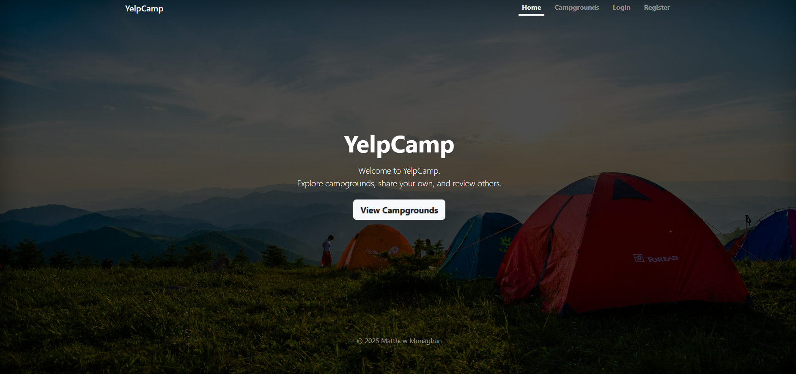
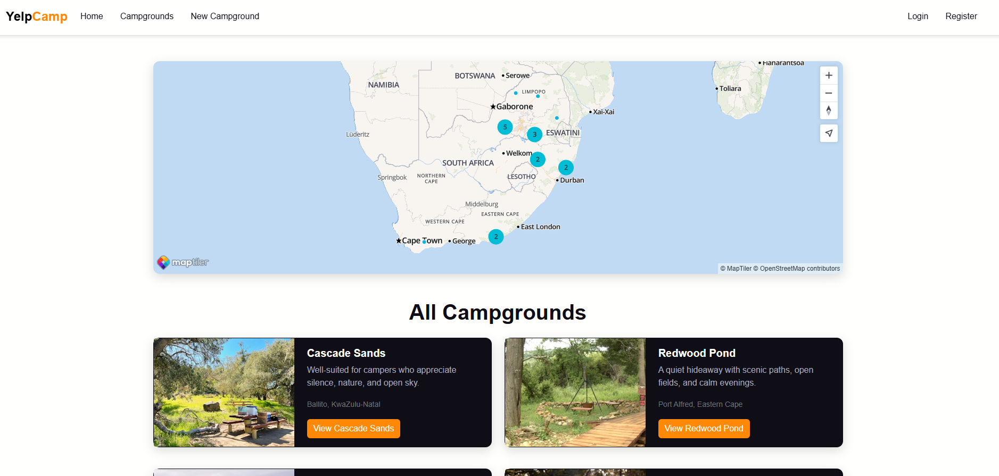
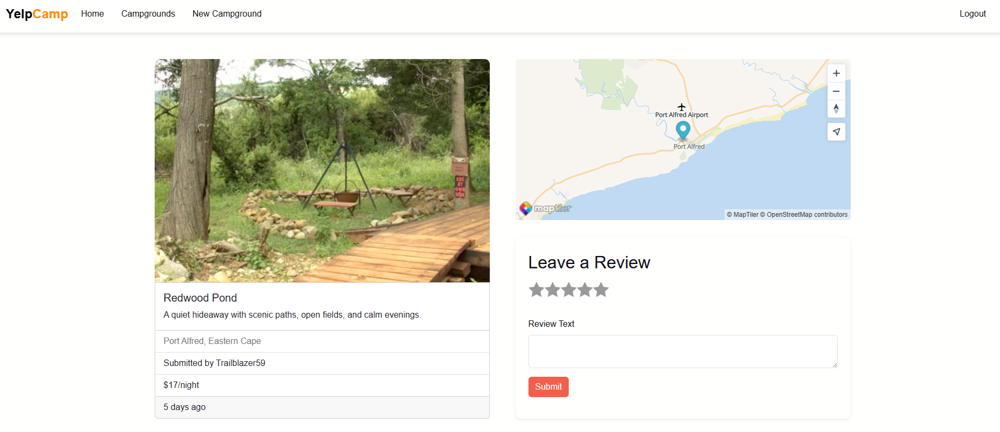
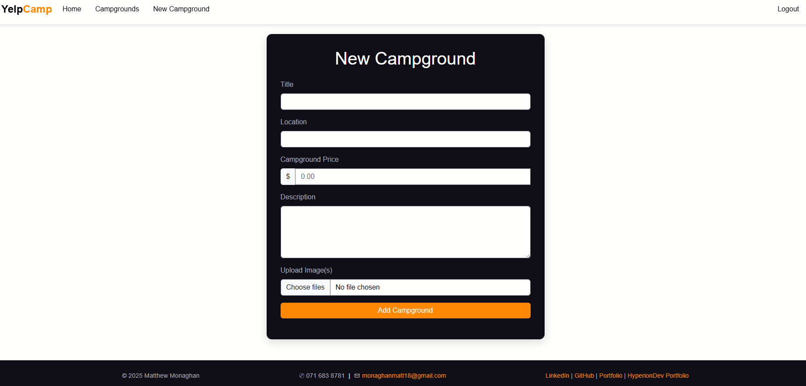
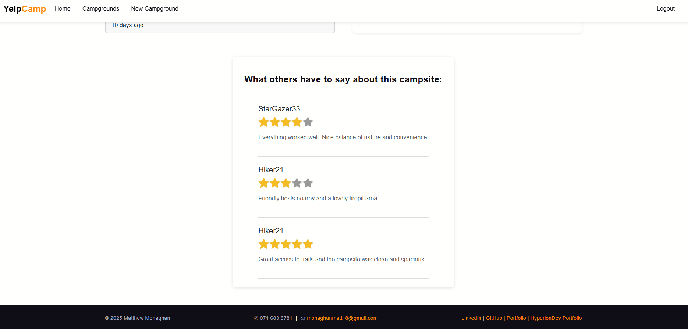
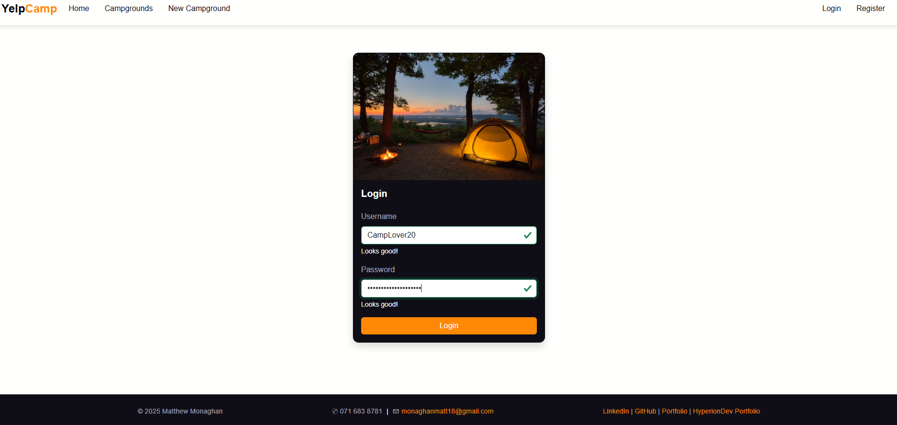

# YelpCamp – Full-Stack Campground Review App

A production-ready full-stack web application for discovering, creating, and reviewing campgrounds. This version has been **completely refactored, optimised, and redesigned** for performance, usability, and deployment.

---



---

## Live Demo

**Hosted on Render:** [https://yelpcamp-7bl3.onrender.com](https://yelpcamp-7bl3.onrender.com)

---

## Screenshots

<p float="left">
  
  
</p>

<p float="left">
  
  
</p>

<p float="left">
  
  
</p>

---

## Tech Stack

**Frontend:** HTML5, CSS3, Bootstrap, EJS templating  
**Backend:** Node.js, Express.js, MongoDB (Mongoose)  
**Auth & Security:** Passport.js (local strategy), Express-session, Authorization middleware  
**Maps & Media:** MapTiler SDK (optimized maps), Cloudinary (image hosting & optimisation)  
**Deployment:** Render (Node service), MongoDB Atlas  

---

## Core Features

### Campgrounds
- Full CRUD: create, edit, delete campgrounds
- Upload multiple images per campground (Cloudinary integration)
- Dynamic, interactive maps with geocoded locations and clustering
- Location validation & error handling

### Reviews
- Create & delete reviews
- One-review-per-user enforcement
- Average rating calculation

### Authentication & Authorization
- User registration, login, logout
- Session-based authentication
- Author-only editing & deletion for campgrounds and reviews

### Maps
- MapTiler integration for fast, cost-effective mapping
- Preprocessed GeoJSON for optimized performance
- Clustered markers with popups
- Auto-fit bounds with max zoom to prevent over-zooming

---

## Key Enhancements & Engineering Decisions

### UI / UX Overhaul
- Redesigned campground card layout for clarity and hierarchy
- Custom cohesive color palette for consistent styling
- Improved spacing, typography, and responsiveness across devices
- Reduced visual clutter while maintaining full functionality

### Map Provider Migration & Performance Optimisation
- Replaced Mapbox with MapTiler for cost-efficient maps
- Preprocessed map data to reduce payload
- Tuned clustering radius and zoom limits for smoother interactions
- Auto-fit bounds with maximum zoom to enhance user experience

### Codebase & Deployment Improvements
- Cleaned unused middleware and legacy code
- Improved environment variable handling for production safety
- Robust error handling and flash messaging
- Verified stable deployment on Render with MongoDB Atlas

---

## Environment Variables

```env
MONGO_URI=
CLOUDINARY_CLOUD_NAME=
CLOUDINARY_KEY=
CLOUDINARY_SECRET=
MAPTILER_API_KEY=
SESSION_SECRET=
```
---

## Local Setup

```bash
git clone https://github.com/yourusername/yelpcamp.git
cd yelpcamp
npm install
node app.js
```
---

App runs on:

```
http://localhost:3000
```

---

*Built, refactored, and deployed by Matthew Monaghan*
